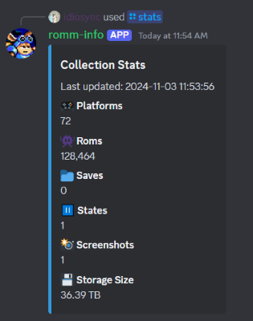
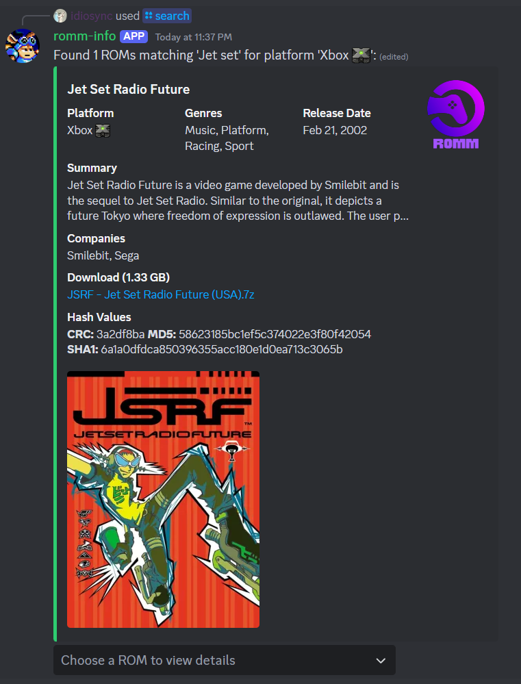
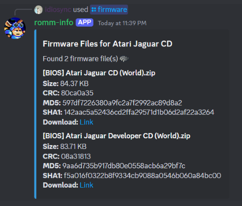
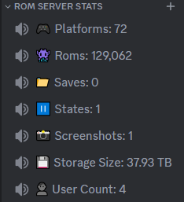

# romm-comm

A Discord bot that integrates with the [RomM](https://github.com/rommapp/romm) API to provide information about your ROM collection.

## Features

Current
- Near real-time ROM collection statistics in voice channel, bot status and via command
- Platform-specific ROM searches that provide download link and game/file information
- Per platform firmware file command that lists firmware files/information and provides download links
- Custom game console emoji uploads upon bot installation, use of said emojis in bot responses and stats
- Help command that lists all commands
- "Switch Shop Info" command that lists instructions on how to connect to the [Tinfoil](https://tinfoil.io/Download) endpoint of connected RomM server
- Rate-limited Discord API interactions
- Caching system for improved performance
- Basic authentication support via http api requests
- Relatively detailed logging system

In Progress
- Initiate RomM library scan globally and by platform
- Random game roll (all platforms)
- QR code generation for 3DS/Vita installation via apps like FBI/[FBI Reloaded](https://github.com/TheRealZora/FBI-Reloaded) and downloads direct to console

Planned (if possible)
- Generate and pass EmulatorJS launcher links via command
- List collections command
- RomM file scan progress reporting (via RomM logs?)
- User count included in stats
- List users command
- Random game roll by platform, by year, by genre, etc
- Docker installation
- Linking Discord users with RomM users (creation of Romm users via role?)
- RomM API key usage so user/pass do not have to be passed (if RomM implements creating API key)
- IGDB integration (currently pulles IGDB cover url from RomM db entry for game)
- Request command that searches IGDB per platform and passes along requested game ID
- Endpoint for request system, possibly as message sent to bot owner (ask RomM to add requests feature?)
- Look up most downloaded games (via RomM logs?) and provide stats via command

## Requirements

- Python 3.8+
- Pycord library
- aiohttp
- python-dotenv

## Installation

1. Clone the repository or download the source code
2. Install required dependencies:
```bash
pip install py-cord aiohttp python-dotenv
```
## Discord Bot Token Creation
- See https://docs.pycord.dev/en/stable/discord.html

## Configuration

Create a `.env` file in the root directory with the following variables:

```env
# Required Settings
TOKEN=your_discord_bot_token
GUILD=your_guild_id
API_URL=your_api_base_url
USER=api_username
PASS=api_password

# Optional Settings
DOMAIN=your_website_domain
SYNC_RATE=3600
UPDATE_VOICE_NAMES=true
CHANNEL_ID=your_channel_id
SHOW_API_SUCCESS=false
CACHE_TTL=300
API_TIMEOUT=10
```

### Configuration Details

#### Required Settings:
- `TOKEN`: Your Discord bot token
- `GUILD`: Discord server (guild) ID
- `API_URL`: Base URL for local Romm instance (http://ip:port)
- `USER`: API authentication username
- `PASS`: API authentication password

#### Optional Settings:
- `DOMAIN`: Website domain for any download links (default: "No website configured")
- `SYNC_RATE`: How often to sync with API in seconds (default: 3600)
- `UPDATE_VOICE_NAMES`: Enable/disable voice channel stats (default: true)
- `SHOW_API_SUCCESS`: Show API sync result messages in Discord (default: false)
- `CHANNEL_ID`: Channel ID for API sync result messages notifications to be sent to (if enabled above)
- `CACHE_TTL`: Cache time-to-live in seconds (default: 300)
- `API_TIMEOUT`: API request timeout in seconds (default: 10)

## Available Commands

### /refresh
Manually update API data from RomM.

### /website
Display the configured website URL. May add more functionality later.

### /stats
Show current collection statistics.



### /platforms
Display all available platforms with their ROM counts.


### /search [platform] [game]
Search for ROMs by platform and game name. Provides:
- Interactive selection menu listing first 25 results (may make configurable)
- Platform selection autofill (pulled from RomM's internal list of avalable platforms)
- File names
- File sizes
- Hash details (CRC, MD5, SHA1)
- Download links pointing to your public URL (user still needs RomM login to DL in browser)
- Cover images when available (if RomM's game entry is properly matched to an IGDB entry)



### /firmware [platform]
List available firmware files for a specific platform. Shows:
- File names
- File sizes
- Hash details (CRC, MD5, SHA1)
- Download links pointing to your public URL (user still needs RomM login to DL in browser)



## Visable Statistics

Voice Channel Stat Display
- If enabled (`UPDATE_VOICE_NAMES=true`), the bot creates voice channels displaying
  platform, rom, save, savestate, and screenshot count as well as RomM storage use size
- Only updates if stats change upon API refresh
- Right now it creates new channels and deletes the old, will soon edit instead
- I'm planning on making emoji's customizable and each VC toggalable individually



Bot "Now Playing" ROM count
- Lists number of ROMs as the bot's status
- Updates whenever API is refreshed via timer or manually


## Error Handling

The bot includes comprehensive error handling and logging:
- API connection issues
- Rate limit management
- Discord API errors
- Data validation
- Cache management

Logs are saved with timestamps and include:
- INFO level for normal operations
- WARNING level for non-critical issues
- ERROR level for critical problems

## Rate Limiting

The bot implements rate limiting to prevent Discord API abuse:
- Default: 30 calls per minute
- Automatic queue management
- Built-in wait times for API calls

## Cache System

Implements an efficient caching system:
- Configurable TTL (Time-To-Live)
- Automatic cache invalidation
- Memory-efficient storage
- Separate caching for different endpoints

## Security

- Basic authentication for API requests using http
- Environment variable configuration
- No sensitive data logging (passwords, etc)
- Proper permission checking

## Troubleshooting

1. Bot not responding:
   - Check Discord bot token
   - Verify bot permissions on Discord's end
   - Check API connectivity to RomM

2. Statistics not updating:
   - Verify API URL
   - Check API credentials
   - Confirm SYNC_RATE setting

3. Voice channels not updating:
   - Ensure UPDATE_VOICE_NAMES is true
   - Verify bot has channel management permissions
   - Check rate limiting settings

## Support

For issues and feature requests, please:
1. Check logs for error messages, I tried to meticulously report errors 
2. Verify configuration settings in the env
3. Ensure all bot permissions are correctly set in the Discord dev settings
4. I'm not promising that development will be super active on my end, so feel free
   to poke around the code yourself and see what's up and suggest changes

## Note

As I am new to coding, this project has utilized a good deal of code produced 
by ai models and modified by me to fit the needs of the project. I am learning 
as I go, and hopefully as the project progresses I will be able to contribute more
and more of my own code. If you see anything glaring, please feel free to reach out
and inform me.
