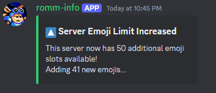
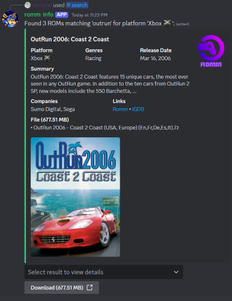
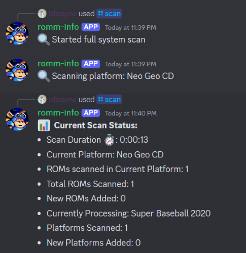
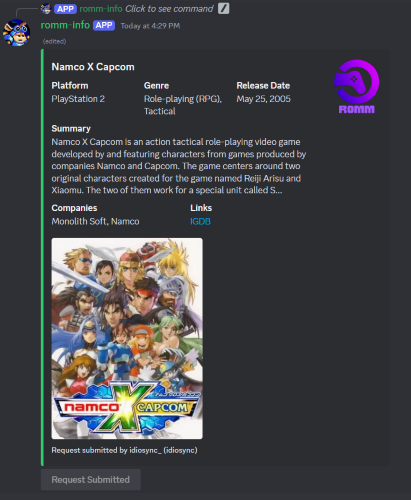
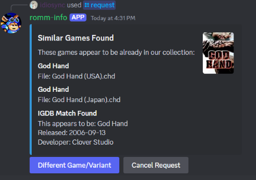
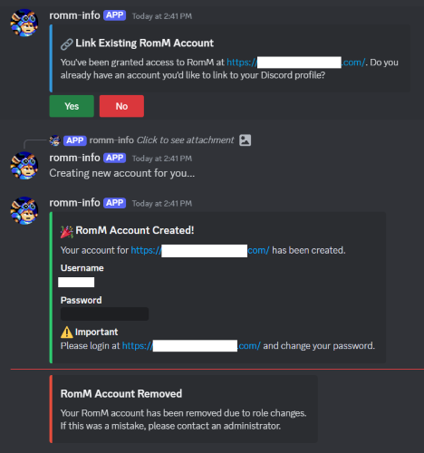

# RomM-ComM (RomM Communicator Module)

A Discord bot that integrates with the [RomM](https://github.com/rommapp/romm) API to provide information about your ROM collection and conrol RomM from Discord.

## Features

Current
- Stats: Near real-time ROM collection statistics in voice channel, bot status and via command
- Search: Platform-specific ROM searches and random ROM roll that provide download link and game/file information
- Search: Support for multi-file games - user can select one, some or all files to download
- Search: Platform based firmware search that lists firmware file information and provides download links
- Scans: Start/stop different types of RomM scans, report back with info about the scan when complete and also during a scan in progress via command
- Request System: Make and manage ROM requests entirely in Discord, now enriched with IGDB metadata
- Emojis: Custom game console emoji uploads upon bot installation, use of said emojis in bot responses and stats
- Emojis: Bot checks for Nitro on the server and if found uploads extended list of emojis, if the bot detects Nitro removed it deverts back to the standard list
- QR code generation: Install games on 3DS/Vita via QR code with apps like FBI/[FBI Reloaded](https://github.com/TheRealZora/FBI-Reloaded)/[VitaShell](https://github.com/RealYoti/VitaShell) (download endpoint auth must be disabled on RomM instance)
- RomM User Management: Manage users, automatically create RomM account for users with specific role and remove RomM accont upon role removal
- Switch Shop Info: Command that lists instructions on how to connect to the [Tinfoil](https://tinfoil.io/Download) endpoint of connected RomM server (download endpoint auth must be disabled on RomM instance)
- Rate-limited Discord API interactions
- Caching system, the bot onnly fetches fresh stats if that particular stat has updated since last fetch

In Progress
- Alternative chat client integrations (Matrix, Telegram, Slack), no eta for now

Planned (if possible)
- Generate and pass EmulatorJS launcher links in game details after search
- Requests dashboard webpage, not sure if this feature will get enough usage to justify
- Look up most popular games (via RomM logs?) and provide stats via command
- More collection information commands (IGDB have/miss, report missing, etc)

## Requirements

- Python 3.8+
- Pycord library
- aiohttp
- python-dotenv
- qrcode
- Pillow
- python-socketio
- requests
- aiosqlite

## Installation

Docker:
1. `docker pull idiosync000/romm-comm:latest`
2. Pass env variables as shown below
3. Pass `/app/data` in the container to host directory, this is where the request DB and emoji sync status are stored

Non-Docker:
1. Clone the repository or download the source code
2. Install required dependencies:
```bash
pip install py-cord aiohttp python-dotenv qrcode Pillow python-socketio requests aiosqlite
```
## Discord Bot Token Creation
- See https://docs.pycord.dev/en/stable/discord.html

## RomM Settings

If you want browser downloads to function for users without logging in and Switch shop/Qr code downloads to function on consoles, set Add `DISABLE_DOWNLOAD_ENDPOINT_AUTH=true` to your RomM environment variables. Without this setting disabled, the user clicking the download link will have to have a RomM account and log in before downloading.

## Configuration

Create a `.env` file in the root directory with the following variables:

```env
# Required Settings
TOKEN=your_discord_bot_token
GUILD=your_guild_id
API_URL=your_api_base_url
USER=api_username
PASS=api_password

# Optional Settings
DOMAIN=your_website_domain
SYNC_RATE=3600
REQUESTS_ENABLED=TRUE
IGDB_CLIENT_ID=your_client_id
IGDB_CLIENT_SECRET=your_client_secret
ENABLE_USER_MANAGER=TRUE
AUTO_REGISTER_ROLE_ID=romm_users_role_id
UPDATE_VOICE_NAMES=true
CHANNEL_ID=your_channel_id
SHOW_API_SUCCESS=false
CACHE_TTL=3900
API_TIMEOUT=10
```

### Configuration Details

#### Required Settings:
- `TOKEN`: Your Discord bot token
- `GUILD`: Discord server (guild) ID
- `API_URL`: Base URL for local Romm instance (http://ip:port)
- `USER`: API authentication username
- `PASS`: API authentication password

#### Optional Settings:
- `DOMAIN`: Website domain for any download links, can use local ip/port if not exposing RomM to the internet (default: "No website configured")
- `SYNC_RATE`: How often to sync with API in seconds (default: 3600)
- `UPDATE_VOICE_NAMES`: Enable/disable voice channel stats (default: true)
- `REQUESTS_ENABLED` : Enable request commands (default: true)
- `IGDB_CLIENT_ID` : IGDB login info for requests metadata (can be the same one used in RomM)
- `IGDB_CLIENT_SECRET` : IGDB login info for requests metadata (can be the same one used in RomM)
- `ENABLE_USER_MANAGER` : Enables user manager module (default: true)
- `AUTO_REGISTER_ROLE_ID` : Discord role ID used for linking Discord users to RomM users and registering new RomM users if granted to Discord user (if user manager enabled)
- `SHOW_API_SUCCESS`: Show API sync results and error messages in Discord (default: false)
- `CHANNEL_ID`: Channel ID for API sync result and user manager notifications to be sent to (if enabled above) and user manager log messages
- `CACHE_TTL`: Cache time-to-live in seconds (default: 3900)
- `API_TIMEOUT`: API request timeout in seconds (default: 10)

## Visable Statistics

Voice Channel Stat Display
- If enabled (`UPDATE_VOICE_NAMES=true`), the bot creates voice channels displaying platform, rom, save, savestate, screenshot and RomM user count as well as RomM storage use size
- Only updates if stats change upon API refresh
- Creates new channels and deletes the old to guarantee no duplicate channels


Bot "Now Playing" ROM count
- Lists number of ROMs as the bot's status
- Updates whenever API data is refreshed via timer or manually


## Emojis

Automatic Emoji management. Provides:
- Upon first boot or joining Discord server (if bot booted before joining) a list of 50 custom emojis is grabbed and uploaded to the server
- Emojis appear automatically next to platform names across bot responses if matching emoji is on the server
- Nitro awareness - bot can detect if Nitro is present on the server and if found uploads extended list of emojis (mostly more obscure consoles and variants)
- If the bot detects Nitro is removed it reverts back to the standard list of 50, so none of the more commonly used emojis are deleted when the limit decreases



     
    , etc

## Available Commands

### /refresh
Manually update API data from RomM.

### /stats
Show current collection statistics.


### /platforms
Display all available platforms with their ROM counts.


### /search [platform] [game]
Search for ROMs by platform and game name. Provides:
- Interactive selection menu listing first 25 results
- Platform selection autofill (pulled from RomM's internal list of avalable platforms)
- File names
- File sizes
- Download links pointing to your public URL or IP if configured
- Cover images when available (if RomM's game entry is properly matched to an IGDB entry)
- React with the :qr_code: emoji and the bot will respond with a QR code for 3DS/Vita dowloads



### /random [platfom]*
- Finds random rom in your collection and displays info outlined in /search command
- *Platform input is optional, if not set it will grab a random rom from a random platform

### /firmware [platform]
List available firmware files for a specific platform. Shows:
- File names
- File sizes
- Hash details (CRC, MD5, SHA1)
- Download links pointing to your public URL or IP


### /scan [option]
Trigger RomM library scan. Options are:
- [platform] [platform name]: Scan a specific platform
- [full]: Perform a full system scan
- [stop]: Stop the current scan
- [status]: Check current scan status
- [unidentified]: Scan unidentified ROMs
- [hashes]: Update ROM hashes
- [new_platforms]: Scan new platforms only
- [partial]: Scan ROMs with partial metadata
- [summary]: View last scan summary



### Requests
- /request - Submit a new request
- /my_requests - View your requests
- /cancel_request - Cancel a pending request
- /request_admin - Admin commands (list/fulfill/reject/addnote)






Request System Features:
- Users can submit ROM requests with platform, game name, and optional details as text
- Searches for existing ROM names in the RomM database to see if there is already a ROM present with the requested game name to avoid unnecessary requests
- Matches request with IGDB entry if possible, if IGDB match is not found user can still submit "Platform, Game" request
- Limit of 5 pending requests per user, so requests do not get overwhelming
- DM notifications to users when their requests are fulfilled/rejected either automatically after a RomM system scan or manually via admin
- Users can view their own requests
- Users can cancel their pending requests
- Uses SQLite database to store requests
- Request system is toggleable via env variable if server admin does not want to use it

Admin Features:
- List all pending requests with game and requester info
- Fulfill or reject requests
- Add notes to requests

Dababase Structure:
- Request ID
- User information
- Platform and game details
- Request status (pending/fulfilled/rejected/cancelled)
- Timestamps
- Admin notes and fulfillment details

### User Manager
- /sync_users - Sync all users who have auto-register role (Admin only)

General:
- User Manager is togglable by server admin, if `ENABLE_USER_MANAGER` is set to `FALSE` the module will avoid being loaded entirely and no commands will show in Discord

Account Creation:
- Creates RomM account when role specified in `AUTO_REGISTER_ROLE_ID` is assigned to Discord user
- Uses Discord display name for RomM username (_1/2/3 etc. if dupe)
- Handles existing accounts, asks user if they have a RomM account and promps them to link accounts before creating new account
- Always creates new accounts as regular users with 'viewer' permissions in RomM
- Generates random password and notifies new user by DM, gives RomM domain info and instructs them to log in and change password
- Preserves existing admin accounts
- Adds warning notifications for admin account links

Role Removal:
- Deletes RomM user account when role is removed from Discord user
- Sends DM notification
- Logs deletion
- Only affects users created by the bot
- Checks if user is admin before deletion
- Preserves admin accounts even if role is removed
- Logs attempted deletions of admin accounts
- Notifies server admins of protection




## Error Handling

The bot includes comprehensive error handling and logging:
- API connection issues
- Rate limit management
- Discord API errors
- Data validation
- Cache management

## Cache System

Implements an efficient caching system:
- Configurable TTL (Time-To-Live)
- Automatic cache invalidation
- Memory-efficient storage
- Separate caching for different endpoints

## Security

- Basic authentication for API requests using http and websockets
- Environment variable configuration instead of storing passwors in code
- No sensitive data logging (passwords, etc)
- Proper permission checking

## Troubleshooting

- Check Discord bot token
- Verify bot permissions on Discord's end
- Check API connectivity to RomM
- Check logs for error messages, I tried to meticulously report errors
- Verify configuration settings in the env
